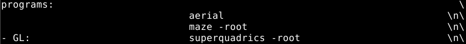

# AerialRubyClient

This is a gem that downloads the Aerial Apple TV videos and saves them to a given directory.
The videos will be sorted by the time of day in which they were taken.

These videos can then be used by XScreenSaver on GNU/Linux.

## Installation

Add this line to your application's Gemfile:

```ruby
gem 'aerial_ruby_client'
```

And then execute:

    $ bundle

Or install it yourself as:

    $ gem install aerial_ruby_client

## Usage

Within irb or in a ruby application, use this method with a target folder (in this example Aerial) as an argument:
```ruby
download_aerials('Aerial')
```

As a result, a new folder will be created and the videos will be downloaded into it. 
The folder will also contain a Ruby script called `xscreensaver_script.rb`.

This script should be moved into `/usr/lib/xscreensaver/` and renamed `aerial`.

Finally, add the `aerial \n\` line to `~/.xscreensaver`:


Note: this gem can be reused periodically to fetch the latest videos from Apple. 
If a video already exists in the target folder, it will be skipped.

Enjoy your new screensaver!

## Contributing

Bug reports and pull requests are welcome on GitHub at https://github.com/m-gb/aerial_ruby_client.

## License

The gem is available as open source under the terms of the [MIT License](https://opensource.org/licenses/MIT).
